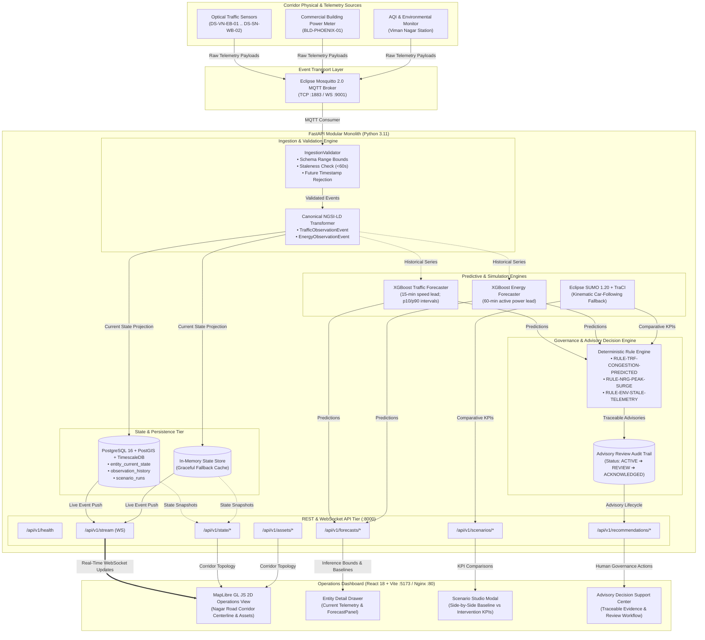

# System Architecture Diagram
## Digital Twin-Enabled Smart City Analytics Platform

> **Document Status:** Reference Architecture Diagram (Deliverable `D-12`)  
> **Pilot Corridor:** Viman Nagar Chowk $\leftrightarrow$ Somnath Nagar Chowk, Nagar Road, Pune  
> **Core Invariant:** Strictly advisory decision support. No automated public infrastructure actuation.

---

---

## Key Subsystems Description

1. **Ingestion & Validation Engine:** Validates incoming physical telemetry against physical sanity boundaries (e.g. speed $0 \dots 120\text{ km/h}$), rejects future timestamps, and detects sensor staleness ($> 60\text{s}$).
2. **State & Persistence Tier:** Primary system of record in PostgreSQL/TimescaleDB with transparent in-memory fallback during local development.
3. **Predictive & Simulation Engines:**
   - **XGBoost Regressors:** 15-minute speed forecast (+31.6% MAE improvement over persistence) and 60-minute energy demand forecast (+77.8% MAE improvement over persistence) running locally on CPU in $< 5\text{ ms}$.
   - **Eclipse SUMO / Kinematic Runner:** Microscopic simulation engine evaluating dynamic signal timing interventions with deterministic seed control.
4. **Governance Rule Engine:** Deterministic, transparent rule evaluation linking evidence directly to operational recommendations with mandatory human review workflows.
5. **Presentation Layer:** MapLibre GL 2D spatial twin, dynamic entity drawers, simulation studio, and advisory center.
