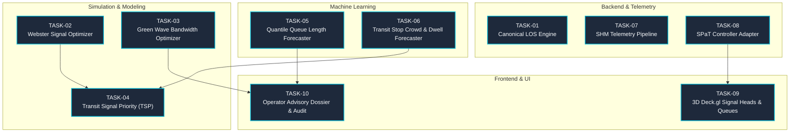

# Intelligent Traffic Mobility & Adaptive Corridor Control: Implementation Task Directory

> **System Component:** Pune Nagar Road Digital Twin (Viman Nagar Chowk ↔ Somnath Nagar Chowk)  
> **Master Specification:** [`TRAFFIC_MANAGEMENT.md`](../../FuturePlans/TRAFFIC_MANAGEMENT.md)  
> **Status:** Active Execution Blueprint

---

## 1. Executive Overview

This task suite translates the comprehensive architectural blueprint defined in [`TRAFFIC_MANAGEMENT.md`](../../FuturePlans/TRAFFIC_MANAGEMENT.md) into ten (10) modular, production-grade engineering tasks. Each task is self-contained with explicit mathematical formulations, database schemas, API data contracts, file targets, and acceptance criteria.

All tasks strictly uphold the architectural invariants defined in [`AGENTS.md`](../../AGENTS.md):
1. **Strict Non-Actuation:** Read-only decision support with dual-key human authorization.
2. **State Separation:** Strict partitioning between `LIVE`, `REPLAY`, `SIMULATION`, and `PREDICTED` records.
3. **Mandatory Provenance:** Every returned or visualized metric carries source mode, timestamp, unit, and quality score.
4. **Hermetic Test Isolation:** 100% self-contained automated tests passing in total isolation.
5. **Strictly Zero Emojis:** Professional vector iconography (Lucide React) and clean typography across all user interfaces.

---

## 2. Master Task Catalog

| Task ID | Task Title | Component / Scope | Spec Ref | Dependencies | Primary Deliverables |
|---|---|---|---|---|---|
| [`TASK-01`](./TASK-01-canonical-los-engine.md) | Canonical Level of Service (LOS) & Hydrodynamic State Engine | Backend & Telemetry | Section 7.1 | None | `backend/services/los_engine.py`, schema migrations |
| [`TASK-02`](./TASK-02-webster-signal-optimizer.md) | Webster Delay-Minimizing Adaptive Signal Timing Optimizer | Simulation & Control | Section 9.1 | None | `simulation/actuated_controller.py`, `tests/test_actuated_tls.py` |
| [`TASK-03`](./TASK-03-arterial-coordination-green-wave.md) | Arterial Two-Way Green Wave Progression & Offset Optimizer | Simulation & Control | Section 9.2 | None | `backend/services/green_wave_optimizer.py`, MAXBAND solver |
| [`TASK-04`](./TASK-04-sumo-transit-bus-priority.md) | SUMO TraCI Multimodal Transit Bus Routes & Priority Simulation | Simulation & Modeling | Section 7.2 | `TASK-02` | `simulation/tsp_controller.py`, `tests/test_tsp_controller.py` |
| [`TASK-05`](./TASK-05-quantile-queue-forecasting.md) | Multi-Horizon Quantile Queue Length Forecaster | Machine Learning | Section 8.1 | None | `ml/train_quantile_queue.py`, `ml/services/queue_forecast_service.py` |
| [`TASK-06`](./TASK-06-multimodal-transit-crowd-forecaster.md) | Transit Stop Crowd Flow & Dynamic Dwell Forecaster | Machine Learning | Section 8.2 | None | `backend/services/transit_dwell_service.py`, surge alert evaluator |
| [`TASK-07`](./TASK-07-structural-health-monitoring.md) | Critical Infrastructure SHM Telemetry Pipeline | Backend & Telemetry | Section 10.1 | None | `backend/services/shm_service.py`, `backend/api/v1/endpoints/shm.py` |
| [`TASK-08`](./TASK-08-spat-controller-feed-adapter.md) | Real-Time SPaT Controller Ingestion Adapter | Backend & Telemetry | Section 7.3 | None | `backend/services/spat_adapter.py`, WebSocket live feed |
| [`TASK-09`](./TASK-09-spat-signal-head-3d-deckgl.md) | Deck.gl 3D Animated Signal Head & Queue Visualizer | Frontend & UI | Section 7.3, 11.2 | `TASK-08` | `SignalHeadLayer.tsx`, `LaneQueueLayer.tsx`, Map toolbar |
| [`TASK-10`](./TASK-10-closed-loop-decision-advisor-ui.md) | Operator Advisory Dossier & Audit Trail UI | Frontend & UI | Section 9.1, 9.2 | `TASK-03`, `TASK-05` | `AdvisoryCard.tsx`, `AuthorizeAdvisoryModal.tsx`, dispatch audit |

---

## 3. Work Allocation by Technical Domain

```
+-----------------------------------------------------------------------------------+
|                         TECHNICAL DOMAIN WORK ALLOCATION                          |
+-----------------------------------------------------------------------------------+
|                                                                                   |
|  [ Backend & Telemetry ]                                                          |
|  - TASK-01: Canonical Level of Service (LOS) & Hydrodynamic State Engine          |
|  - TASK-07: Critical Infrastructure SHM Telemetry Pipeline (Vibration / Strain)   |
|  - TASK-08: Real-Time SPaT Controller Ingestion Adapter (NTCIP 1202 / J2735)      |
|                                                                                   |
|  [ Simulation & Control ]                                                         |
|  - TASK-02: Webster Delay-Minimizing Adaptive Signal Timing Optimizer (TraCI)    |
|  - TASK-03: Arterial Green Wave Two-Way Progression Optimizer (MAXBAND / MILP)    |
|                                                                                   |
|  [ Simulation & Modeling ]                                                        |
|  - TASK-04: SUMO TraCI Multimodal Transit Bus Routes & Priority Simulation        |
|                                                                                   |
|  [ Machine Learning & Analytics ]                                                 |
|  - TASK-05: Multi-Horizon Quantile Queue Length Forecaster (XGBoost / TreeSHAP)   |
|  - TASK-06: Multimodal Transit Stop Crowd Flow & Dynamic Dwell Time Forecaster     |
|                                                                                   |
|  [ Frontend & UI ]                                                                |
|  - TASK-09: Deck.gl 3D Animated Signal Head & Lane Queue Visualizer               |
|  - TASK-10: Operator Advisory Dossier & Audit Trail Decision Support UI           |
|                                                                                   |
+-----------------------------------------------------------------------------------+
```

---

## 4. Execution Dependency Flowchart



---

## 5. Definition of Done Checklist for Every Task

Before any task in this directory is signed off as completed, it must pass this verification protocol:
- [ ] **Architecture Check:** Fully conforms to the mathematical model and data schema outlined in its task specification.
- [ ] **State Separation Invariant:** Dynamic values persist strictly to designated tables (`traffic_flow_observations`, `simulation_runs`, `ml_forecasts`).
- [ ] **Data Honesty:** No replayed data labeled as live; confidence intervals and model baselines strictly documented.
- [ ] **Automated Tests:** Comprehensive unit and hermetic tests in `tests/` passing cleanly with 100% pass rate (`pytest`).
- [ ] **Build Validation:** If frontend components are modified, `npm run build` compiles with 0 errors.
- [ ] **Zero Emojis:** Strictly no emoji glyphs in code, logs, or UI elements.
- [ ] **Git Discipline:** Commit messages are clean, conventional, and contain zero phase tags or "phase" numbers.
